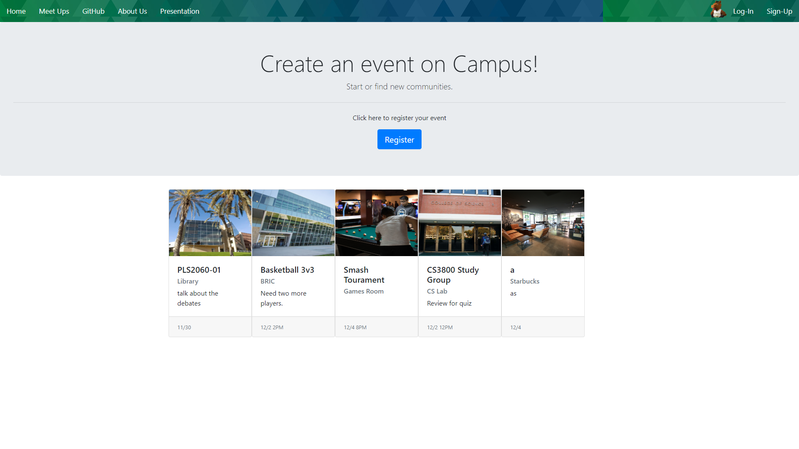

# Bronco Chat

A way to connect with fellow Cal Poly Pomona Students

## Getting Started




## How to run

Importing the Project into Eclipse

1. File->Import->Maven->Existing Maven Projects
2. Select the directory containing the pom.xml file
3. Finish

Run Project Locally

1. Locate the WebsocketDemoApplication.java in src/main/java/com/example/websocketdemo and right-click on it->Run As->Java Application
2. Verify at: 
```
http://localhost:5000/
```

## Features

* User Sign up and Login
* Chat Rooms for specific college
* Schedule events on Meetup page 
* Built with Spring Boot

## Authors

* Alan Trieu
* Eric Ramirez
* Min Park
* Roberto Ramirez
* Kevin Lu
